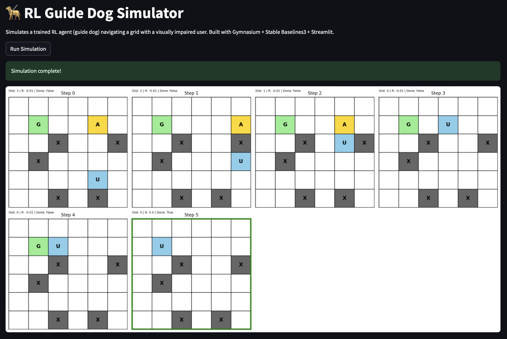

# RL-Guide-Dog

This is a reinforcement learning-based navigation system inspired by guide dogs, where a guide‐dog agent leads a simulated user through a grid world with obstacles to reach a goal. This repo includes:

- A custom Gymnasium environment (GuideDogEnv).

- PPO training (Stable Baselines3 or from‐scratch PyTorch).

- Rollout visualization with Matplotlib.

- An interactive Streamlit app for live simulations.



# File Structure
```bash
```bash
rl-guide-dog/
├── envs/
│   └── guide_dog_env.py   # Custom Gymnasium env
├── train.py               # SB3 PPO training
├── ppo_from_scratch.py    # PyTorch PPO implementation
├── test.py                # Rollout collection & visualization
├── visualize.py           # Storyboard plotting
├── app.py                 # Streamlit interface
├── requirements.txt       # Python deps
└── README.md              # Project documentation
```
```
# How to run

To train a PPO agent on the GuideDog environment using:
```bash
python train.py
```
A trained model will be saved as ppo_guide_dog.zip.


Then run an episode and display a storyboard using:
```bash
python test.py
```
This generates a visual grid-by-grid plot showing agent, user, goal, rewards, and terminal status.

To visualize the rollouts on the streamlit app, run:
```bash
streamlit run app.py
```

# Proximal Policy Optimization
The algorithm used to train the agent is called Proximal Policy Optimization, an on-policy actor‑critic method which learns a policy (actor) and a value function (critic) simultaneously. It optimizes a Clipped Surrogate Objective to prevent excessive divergence.
To visualize the rollouts on the streamlit app, run:
```bash
streamlit run app.py
```

# Proximal Policy Optimization
The algorithm used to train the agent is called Proximal Policy Optimization, an on-policy actor‑critic method which learns a policy (actor) and a value function (critic) simultaneously. It optimizes a Clipped Surrogate Objective to prevent excessive divergence.
# License
MIT License

